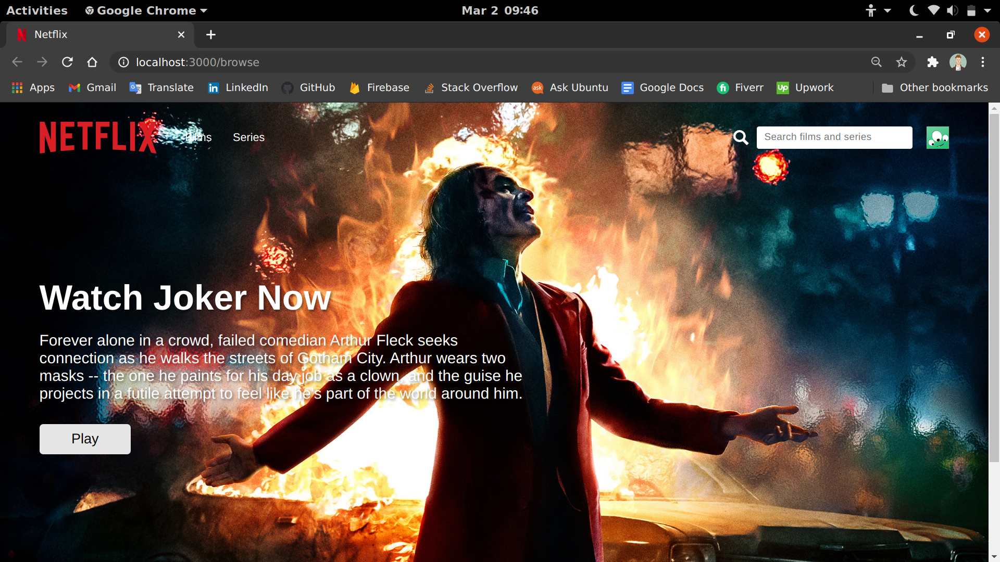
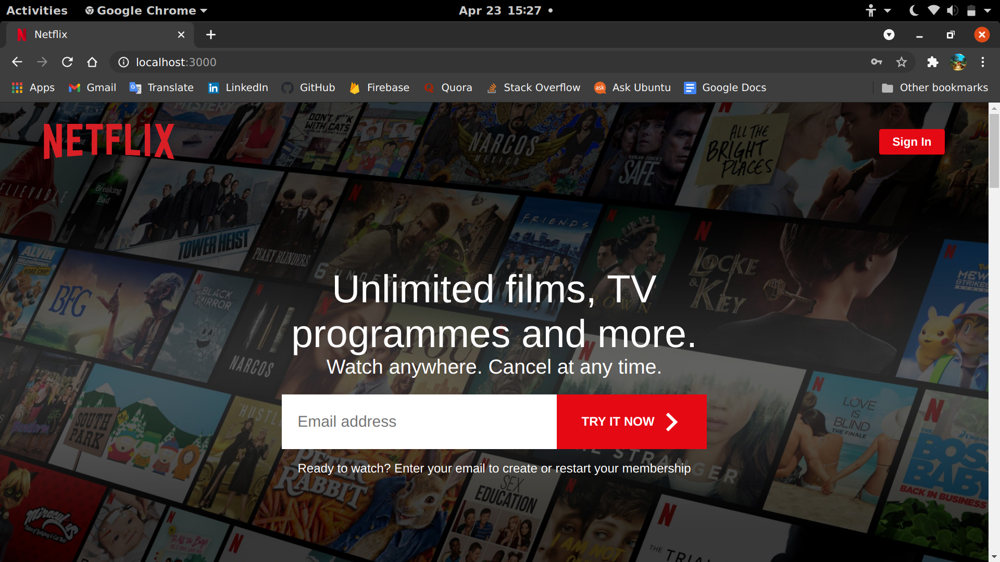
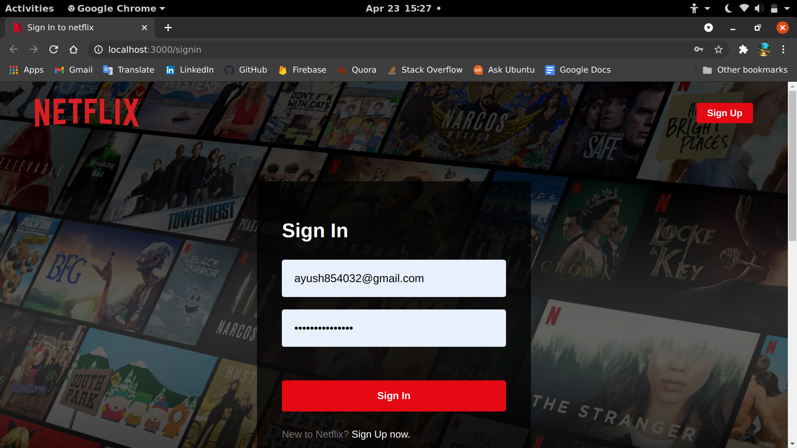
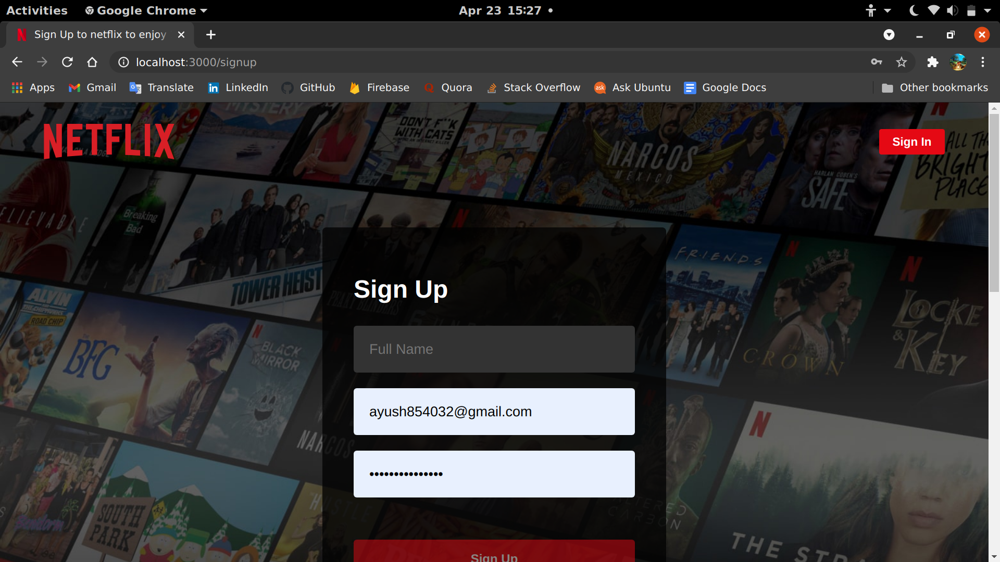

# Netflix Clone

Netflix clone was built using:

- React (Custom Hooks, Context),
- Firebase & Styled Components

## I have built the following pages within this application:

- ### Homepage

  

- ### Sign in

  

- ### Sign up

  

- ### Browse
  

There are five different pages, `Browse`, `Profile` using **protected routes** with **auth listeners**.

**Firebase firestore** handles all the data and that data is retrieved using a custom hook `useContent()`; authentication is used on all pages, which is handled by **Firebase** as well.

I used compound components (just a design pattern) to build my components. The styling is all handled via styled components.

## Available Scripts

In the project directory, you can run:

### `npm start`

Runs the app in the development mode. Open [http://localhost:3000](http://localhost:3000) to view it in the browser.

### `npm test`

Runs the testing scripts to test the app.
